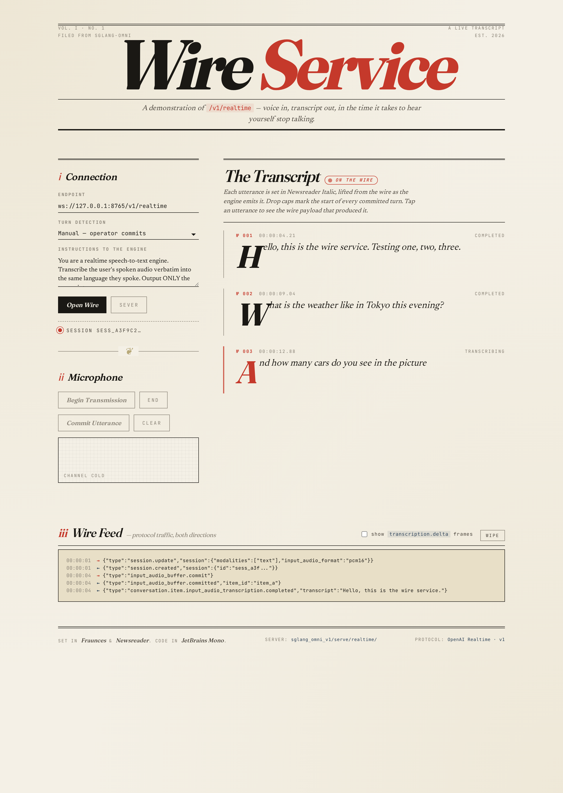

# Wire Service — /v1/realtime web demo



Editorial-broadsheet single-page client for `/v1/realtime`. Captures
the microphone, streams PCM16 chunks to the WebSocket, renders
transcription deltas live with drop caps and a vermilion in-progress
rule. Vanilla HTML/CSS/JS — no build step.

## Run

1. **Start the server** (with the realtime endpoint enabled):

   ```bash
   sgl-omni serve \
     --model-path Qwen/Qwen3-Omni-30B-A3B-Instruct \
     --text-only \
     --port 8765 \
     --enable-realtime
   ```

2. **Serve this directory** over HTTP (browsers won't grant
   `getUserMedia` to `file://`):

   ```bash
   cd playground/web/realtime
   python -m http.server 8080
   ```

3. **Open** <http://127.0.0.1:8080> in a modern browser. Click
   **Connect**, then **Start microphone**, then either:
   - **Manual commit** mode → click **Manual commit** when you finish a
     sentence;
   - **Server VAD** mode → just speak; the server detects boundaries
     and auto-commits.

## What you'll see

| UI panel | Meaning |
|---|---|
| **Server URL** | WebSocket endpoint to connect to. |
| **Turn detection** | Manual (client commits) vs. server VAD (silero auto-commit). |
| **Instructions** | System prompt sent in `session.update`. |
| **Transcripts** | Each utterance appears as a card; deltas stream in live, the card turns green on `transcription.completed`. |
| **Event log** | Raw protocol events both directions. Toggle the checkbox to also include the high-volume `transcription.delta` frames. |

## Notes

- The page constructs its own `AudioWorklet` inline so there's no build
  step / package.json required.
- Audio is captured at 16 kHz, converted to PCM16 little-endian, and
  base64-encoded into `input_audio_buffer.append` frames.
- The page does no error handling beyond updating the status line —
  matching the project's house style. If the WS drops mid-session,
  reconnect.
